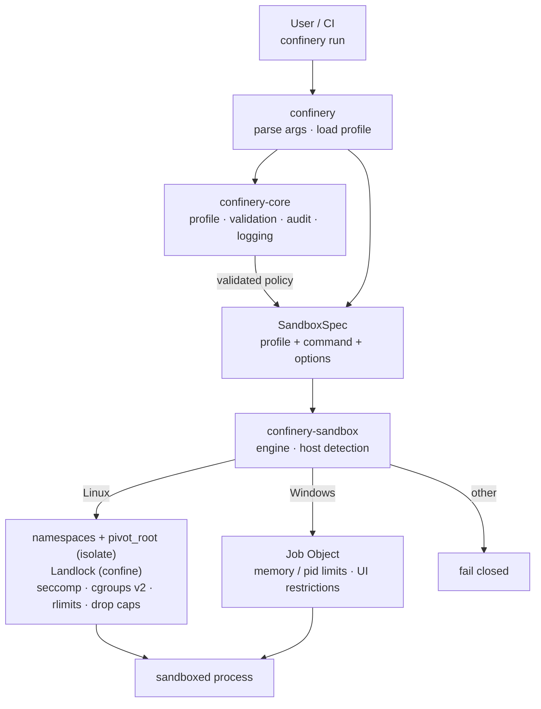

# Confinery

[](https://github.com/confinery/confinery/actions/workflows/ci.yml)
[](https://crates.io/crates/confinery)
[](LICENSE)

Confinery runs a command inside a locked-down sandbox. It's built for wrapping AI assistants and the tools they invoke, so a coding agent can work in a project without reaching your SSH keys, cloud credentials, or the wider system.

One static binary, Linux and Windows. Isolation is layered and fails closed: each defence is independent, so a gap in one does not open the box.

```
confinery run --profile assistant.toml -- claude
confinery run -- python3 untrusted_script.py
```

## Architecture



Policy lives in `confinery-core` with no OS calls. `confinery-sandbox` turns it into concrete kernel controls for the current platform. `confinery` is the CLI crate that ties them together and builds the `confinery` binary. Details in [docs/architecture.md](docs/architecture.md).

## Install

```
cargo install confinery
```

Or download a signed binary from the [releases page](https://github.com/confinery/confinery/releases), or build from source:

```
cargo build --release -p confinery
# static Linux binary:
cargo build --release --target x86_64-unknown-linux-musl -p confinery
```

The binary is `confinery`.

## Quick start

```
# See what your host supports
confinery doctor

# Run a command under the least-privilege default profile
confinery run -- ./run-tests.sh

# Use a profile and record an audit trail
confinery init strict -o strict.toml
confinery run --profile strict.toml --audit run.jsonl -- python3 job.py

# Show the plan without executing anything
confinery run --dry-run -- npm install

# Write a starter profile and check it
confinery init assistant -o assistant.toml
confinery profile validate assistant.toml
```

## What gets isolated

On Linux, Confinery stacks these layers (see [docs/security-model.md](docs/security-model.md)):

| Layer | Mechanism | Default |
|-------|-----------|---------|
| Filesystem | mount namespace + `pivot_root`, or Landlock | deny-by-default allowlist |
| Network | network namespace | none |
| Processes | IPC/UTS namespaces | isolated (PID namespace not yet implemented; see [Known limits](docs/security-model.md#known-limits)) |
| Syscalls | seccomp-BPF | dangerous calls blocked |
| Privileges | capability drop + `no_new_privs` | all capabilities dropped |
| Resources | cgroups v2 + rlimits | 2 GiB, 512 pids, 1024 fds |
| Identity | user namespace | mapped to an unprivileged user |

On Windows, a Job Object bounds memory and process count, kills the whole tree on exit, and applies UI restrictions; the environment is filtered. Filesystem and network confinement need WSL2, Windows Sandbox, or the experimental `wslc` backend (`windows.container_image` in a profile; see [docs/platform-support.md](docs/platform-support.md#wslc-backend-experimental-preview-dependent)), and are otherwise reported as not enforced rather than silently skipped.

Confinery picks the strongest plan the host supports. Where unprivileged user namespaces exist, it builds a fresh root and network stack (**isolate**). Otherwise it falls back to Landlock, seccomp, rlimits, and capability dropping (**confine**). `confinery doctor` tells you which applies.

## Profiles

A profile is a reproducible TOML (or JSON) description of one sandbox. Omitted sections fall back to least-privilege defaults. Full reference: [docs/profiles.md](docs/profiles.md).

```toml
name = "example"

[filesystem]
read_only  = ["/usr", "/etc/ssl"]
read_write = ["./"]
tmpfs      = ["/tmp"]
deny       = ["~/.ssh", "~/.aws"]

[network]
mode = "none"          # none | loopback | allowlist | full

[resources]
memory  = "2GiB"
cpu     = 2
timeout = "10m"

[syscalls]
default = "allow"      # allow + denylist, or errno/kill + allowlist
preset  = "hardened"
```

Built-in templates: `assistant`, `strict`, `dev`, `minimal` (`confinery init <name>`).

## Commands

```
confinery run          run a command inside a sandbox
confinery doctor       report host isolation capabilities
confinery profile      validate | show | list
confinery init         write a starter profile
confinery completions  print a shell completion script (bash, zsh, fish, elvish, powershell)
```

`confinery run` returns the sandboxed process's own exit code, so it drops cleanly into scripts and CI.

## Building and testing

```
cargo test --workspace
cargo clippy --all-targets -- -D warnings
cargo fmt --all --check
```

CI and signed releases run entirely through GitHub Actions ([.github/workflows](.github/workflows)).

## Documentation

- [Architecture](docs/architecture.md) — crates and how a run flows through them
- [Security model](docs/security-model.md) — the layers and their limits
- [Profiles](docs/profiles.md) — every field, with examples
- [Platform support](docs/platform-support.md) — what works where
- [Changelog](CHANGELOG.md) — what changed in each release

## Status

Confinery is young. The Linux backend is complete and tested; the Windows backend covers Job Objects, plus an experimental, unverified `wslc`-backed path for real filesystem/network confinement (see [docs/platform-support.md](docs/platform-support.md#wslc-backend-experimental-preview-dependent)). Treat it as defence in depth, not a substitute for a VM when running actively hostile code.

## License

Apache-2.0. See [LICENSE](LICENSE).
